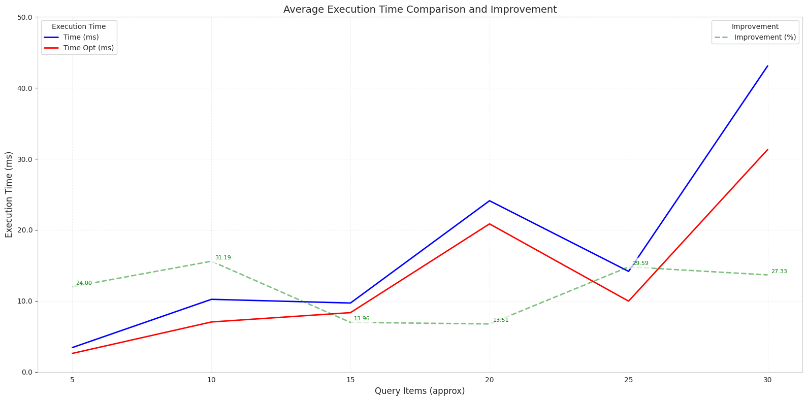

# Simple Boolean Retrieval with Query Optimization

This repository contains a basic implementation of an **Information Retrieval System** using **Boolean Retrieval** with an added layer of **Query Optimization**.

## Features
- **Inverted Index** creation for efficient document retrieval
- **Tokenization** and **Data Preprocessing** (handling missing values, duplicates)
- **Query Processing** with support for Boolean operators: `AND`, `OR`, `NOT`
- Two retrieval methods: **Tree-Based Processing** and **Optimized Query Processing**

## Dataset
The system uses a collection of news articles with attributes like `title`, `author`, `content`, etc., for building the index. 

## Results
Query processing speed is significantly improved using optimization, as demonstrated by the performance comparison chart below:

## How to Run
1. Clone the repository.
2. Run the notebook in Google Colab: [Colab Notebook](https://s.id/Colab_STBI2_498550).
3. Explore query processing with the dataset.
